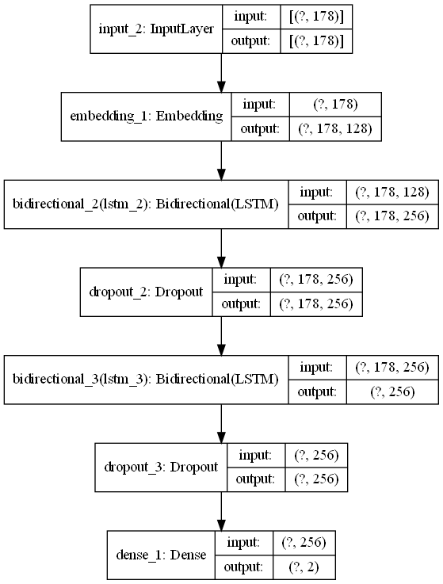

# Sentiment-Analysis
# Background
Sentiment analysis, often known as opinion mining, is a natural language processing (NLP) method for identifying the positivity, negativity, or neutrality of data. Businesses frequently do sentiment analysis on textual data to track the perception of their brands and products in customer reviews and to better understand their target market.

# Description
The dataset provide a set of 35,000 highly polar movie reviews for training and 15,000 for testing. This project is to predict the number of positive and negative reviews using deep learning algorithms with LSTM layer including additional Embedding and Bidirectional layer.

# How to Run the Project
## How to Train the model yourself
1. Clone the repository
2. Open the directory
3. Edit the `nlp_training.py` to your liking and run the file
## How to Test the model
1. Locate the `nlp_deploy.py` inside the previous directory of the cloned repository
2. Run the file on your chosen IDEs
3. Input the movie review
4. If done correctly, this will generate the results

## Neural Network Model Plot

## Model Performance on The Test Dataset
## Classification Report

# Credits
- [Markdown badges source](https://github.com/Ileriayo/markdown-badges)
- [Dataset](https://raw.githubusercontent.com/Ankit152/IMDB-sentiment-analysis/master/IMDB-Dataset.csv)
